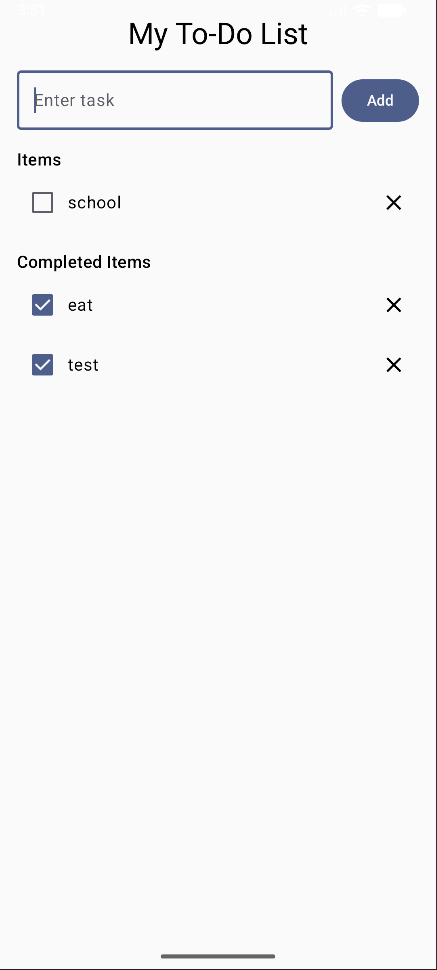

# To-Do List App

- Add tasks
- Mark tasks as completed or active
- Delete tasks
- See separate sections for **Active** and **Completed** tasks
- Persistent state across simple configuration changes (e.g., screen rotation)

Screenshots
  

## Concepts Used
1. Data Class
2. State
3. State Hosting
   

